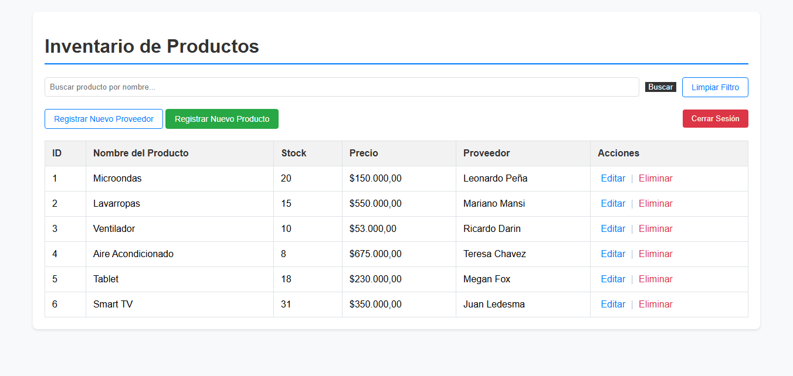
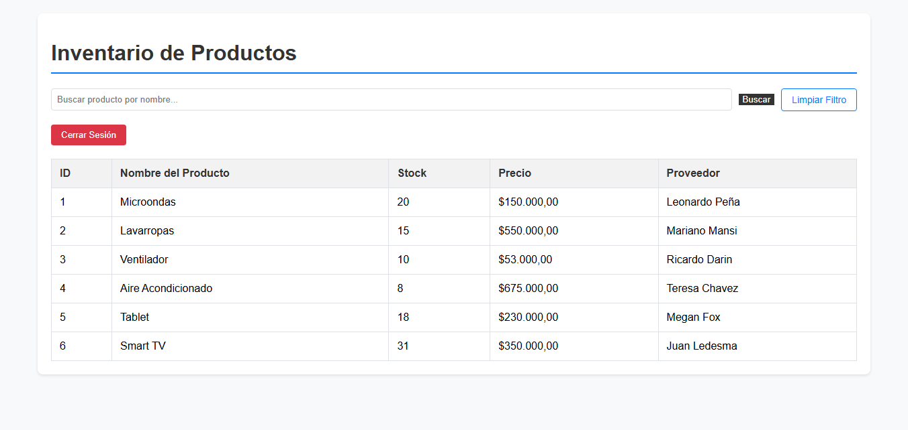

# Sistema de Gestión de Inventario y Stock (Java 21 & Spring Boot 3)

Este proyecto es una aplicación web full-stack diseñada para la gestión integral de productos y proveedores. Implementa un sistema CRUD robusto, seguridad perimetral basada en roles y una interfaz dinámica que adapta sus funciones según el nivel de acceso del usuario.

## Tecnologías / Stack

* **Lenguaje:** Java 21 (LTS)
* **Framework:** Spring Boot 4.0.0
* **Seguridad:** Spring Security (Autorización por roles y protección de rutas)
* **Base de Datos:** PostgreSQL
* **Persistencia:** Spring Data JPA / Hibernate
* **Frontend:** Thymeleaf + Spring Security Extras (Renderizado condicional)
* **Build Tool:** Maven

## Seguridad y Control de Acceso

La aplicación implementa una segregación de funciones estricta. La interfaz de usuario se adapta dinámicamente: los botones de "Editar", "Eliminar" y "Registrar" solo se renderizan para usuarios con privilegios elevados.

### Cuentas de Prueba

| Rol | Usuario | Contraseña | Permisos | Vista de Interfaz |
| :--- | :--- | :--- | :--- | :--- |
| **Administrador** | `admin` | `password` | CRUD completo | Acceso total a botones y formularios |
| **Usuario** | `user` | `password` | Solo lectura | Solo tabla de consulta y buscador |

---

## Vistas del Proyecto

### 1. Gestión de Acceso
Autenticación personalizada. El sistema redirige automáticamente según el rol asignado en la lógica de `SecurityConfig`.


### 2. Comparativa de Interfaz por Rol (Thymeleaf + Security)
Esta sección demuestra la capacidad del sistema para ocultar elementos sensibles del DOM basándose en la autenticación del servidor.

| Vista de Administrador (Control Total) | Vista de Usuario (Consulta) |
| :--- | :--- |
|  |  |

### 3. Filtros y Búsqueda Avanzada
Implementación de búsqueda insensible a mayúsculas/minúsculas para una localización rápida de stock.


### 4. Formularios de Registro
Diseño orientado a la integridad de datos, permitiendo la vinculación de productos con proveedores existentes.

| Registro de Proveedor | Registro de Producto |
| :--- | :--- |
|  |  |

---

## Configuración e Instalación

1.  **Base de Datos:** Cree una base de datos en PostgreSQL llamada `gestor_inventario_db`.
2.  **Configuración:** Los parámetros de conexión se encuentran en `application.properties`:
    ```properties
    spring.datasource.url=jdbc:postgresql://localhost:5432/TU_BASE_DE_DATOS
    spring.datasource.username=TU_USUARIO
    spring.datasource.password=TU_CONTRASEÑA
    ```
3.  **Ejecución:**
    ```bash
    mvn spring-boot:run
    ```
4.  **Acceso:** `http://localhost:8080/`