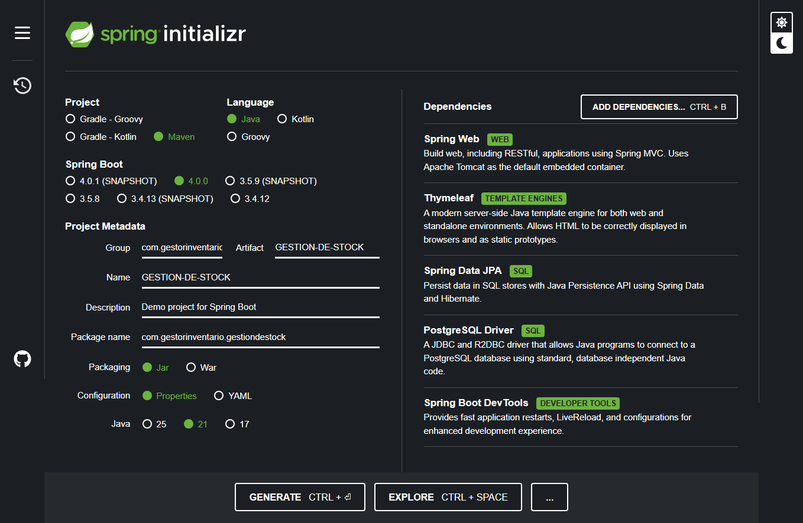
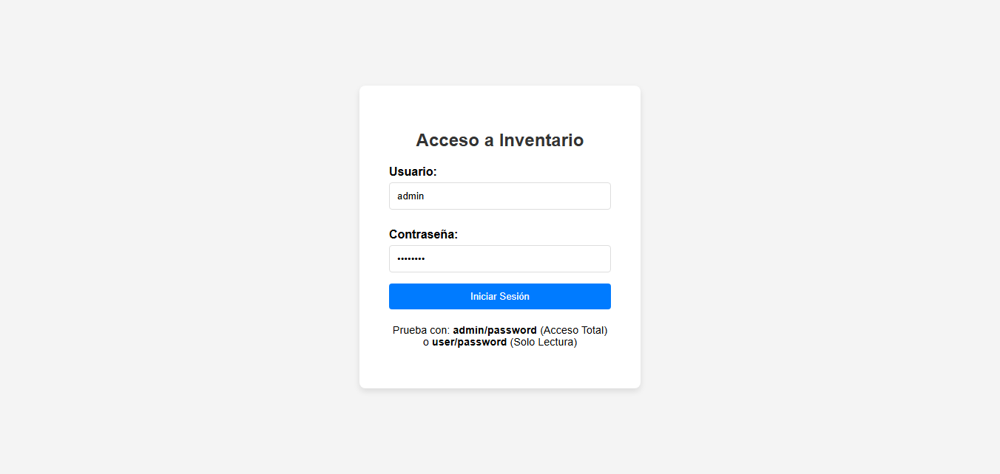
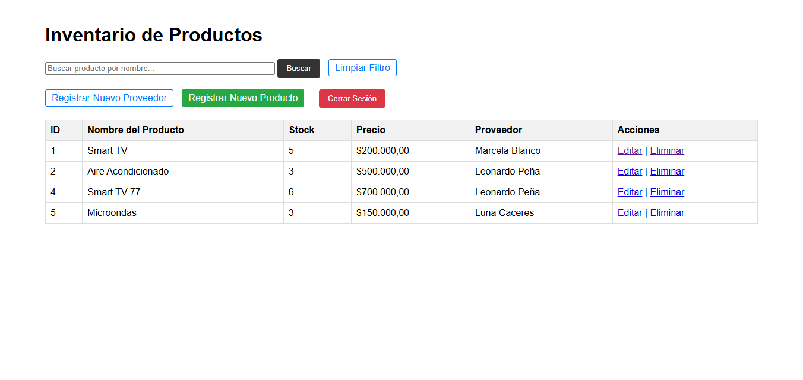
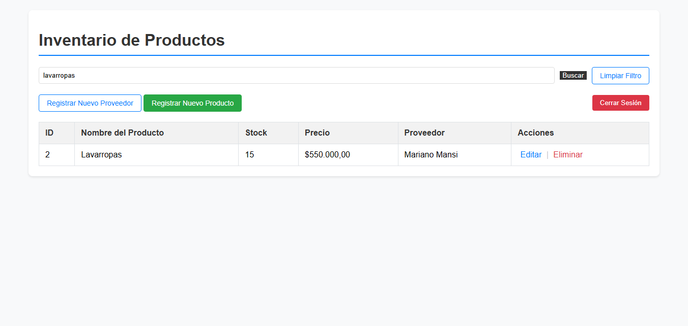
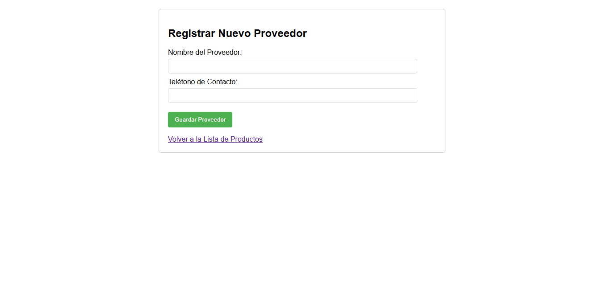
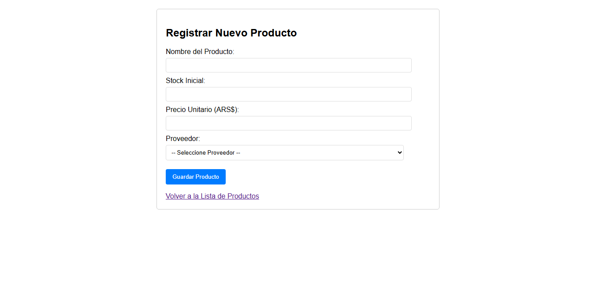

# Sistema de Gestión de Inventario y Stock (CRUD con Spring Security)

Este proyecto es una aplicación web full-stack diseñada para la gestión de productos, inventario y proveedores. Demuestra la implementación de un CRUD (Create, Read, Update, Delete) robusto, autenticación basada en roles y filtros de búsqueda avanzados.

## Tecnologías / Stack

* **Lenguaje:** Java 21
* **Framework:** Spring Boot 4.0.0
* **Web Framework:** Spring MVC
* **Seguridad:** **Spring Security** (Autenticación en memoria y Autorización por roles).
* **Base de Datos:** PostgreSQL
* **Persistencia:** Spring Data JPA / Hibernate
* **Frontend:** Thymeleaf (Server-Side Rendering)
* **Build Tool:** Maven

## Configuración Inicial del Proyecto

El proyecto fue inicializado con Spring Initializr. Esta captura documenta las dependencias clave que hacen posible el desarrollo Full-Stack con autenticación y vista del lado del servidor:

| Dependencia | Propósito |
| :--- | :--- |
| **Spring Web** | Framework MVC y servidor embebido (Tomcat). |
| **Thymeleaf** | **Motor de plantillas para renderizado del Frontend (Vistas y Login)**. |
| **Spring Data JPA** | Persistencia y conexión con la base de datos. |
| **PostgreSQL Driver** | Conexión específica con la base de datos de producción. |
| **Spring Security** | *No se muestra en la captura, pero se implementó para la autenticación por roles.* |



## Características Implementadas

* **Gestión de Inventario (CRUD):** Funcionalidades completas para administrar productos y proveedores.
* **Autenticación y Autorización:**
    * Log-in personalizado utilizando Spring Security.
    * Control de acceso basado en roles (`ADMIN` vs. `USER`).
    * `ADMIN` tiene acceso completo (Crear, Editar, Eliminar).
    * `USER` tiene acceso de solo lectura (Ver listado y Buscar).
* **Modelo de Datos Relacional:** Implementación de la relación One-to-Many entre Productos y Proveedores.
* **Filtros de Búsqueda:** Búsqueda dinámica y en tiempo real de productos por nombre (ignorando mayúsculas y minúsculas).
* **Formato Profesional:** Precios y Stock formateados correctamente en la interfaz de usuario.

## Instrucciones de Ejecución

1.  **Base de Datos:** Asegúrese de tener PostgreSQL instalado y una base de datos creada (ej: `gestor_inventario_db`).
2.  **Configuración:** Actualice las credenciales de conexión en el archivo `src/main/resources/application.properties` (URL, username y password).
3.  **Ejecutar:** Use su IDE (VS Code) o la terminal para ejecutar la aplicación:
    ```bash
    mvn spring-boot:run
    ```
4.  **Acceso:** Navegue a `http://localhost:8080/`

### Cuentas de Prueba

| Rol | Usuario | Contraseña | Permisos |
| :--- | :--- | :--- | :--- |
| **Administrador** | `admin` | `password` | CRUD completo |
| **Usuario** | `user` | `password` | Solo lectura |


## VISTAS DEL PROYECTO

Aquí puedes ver el flujo de la aplicación.

### 1. Pantalla de Acceso (Spring Security)

La aplicación implementa una autenticación robusta mediante Spring Security con una vista personalizada. Se demuestra la segregación de responsabilidades mediante roles: `admin` (CRUD total) y `user` (Solo lectura).



### 2. Dashboard de Inventario y Filtros

La vista principal lista todos los productos con el precio formateado correctamente. Incluye una barra de búsqueda que filtra productos por nombre en tiempo real, mejorando la usabilidad.



### 3. Búsqueda y Lectura (Usuario Básico)

Se demuestra el filtro de búsqueda por nombre (`keyword`) funcionando, lo que permite a los usuarios (incluso a los de rol `USER`) encontrar productos específicos fácilmente.



### 4. Formulario de Registro de Proveedor

Formulario simple para crear la entidad `Proveedor`, fundamental para la relación One-to-Many.



### 5. Formulario de Registro de Producto

El formulario de `Producto` permite registrar Stock, Precio y, crucialmente, seleccionar el `Proveedor` asociado de un listado dinámico.

